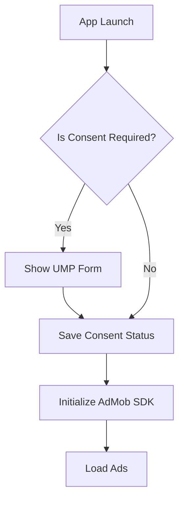

# Host App Requirements

This document outlines the strict prerequisites, permissions, and dependencies required by the CodeWithThiru Platform, broken down by module. Adhering to these requirements ensures stable performance and compliance with Google Play Store policies.

## Module Breakdown

### 1. Core Module (`com.codewiththiru.platform:core`)

The Core module handles initialization, dependency injection (Hilt), and basic lifecycle monitoring.

**Required Permissions:**
| Permission | Reason |
| :--- | :--- |
| `android.permission.INTERNET` | Required for remote configuration and crash reporting. |
| `android.permission.ACCESS_NETWORK_STATE` | Required to check connectivity before making API calls. |

**Dependencies:**
*   `androidx.core:core-ktx:1.12.0`
*   `org.jetbrains.kotlinx:kotlinx-coroutines-android:1.7.3`
*   `com.google.dagger:hilt-android:2.50`

### 2. Ads Module (`com.codewiththiru.platform:ads`)

Handles App Open, Banner, Interstitial, and Rewarded ads using Google AdMob.

**Required Permissions:**
| Permission | Reason |
| :--- | :--- |
| `com.google.android.gms.permission.AD_ID` | Required to fetch advertising IDs for personalized ads. |

**Dependencies:**
*   `com.google.android.gms:play-services-ads:23.0.0`
*   `com.google.android.ump:user-messaging-platform:2.2.0`

**Consent Flows (GDPR / CPRA):**
Host apps *must* implement the Google User Messaging Platform (UMP) SDK flow before initializing ads. The platform provides a wrapper, but the host app must trigger it on the splash screen.

### 3. Billing Module (`com.codewiththiru.platform:billing`)

Manages in-app purchases and subscriptions.

**Required Permissions:**
| Permission | Reason |
| :--- | :--- |
| `com.android.vending.BILLING` | Required to communicate with the Google Play Billing service. |

**Dependencies:**
*   `com.android.billingclient:billing-ktx:6.2.0`

### 4. Analytics Module (`com.codewiththiru.platform:analytics`)

Collects user engagement data and sends it to Firebase Analytics and the internal CWT data warehouse.

**Required Permissions:**
*None beyond Core.*

**Dependencies:**
*   `com.google.firebase:firebase-analytics-ktx:21.5.1`
*   `androidx.work:work-runtime-ktx:2.9.0` (For batching and background sync)

## Target API Level Requirements
*   **minSdkVersion:** 24 (Android 7.0 Nougat)
*   **targetSdkVersion:** 34 (Android 14)
*   **compileSdkVersion:** 34
