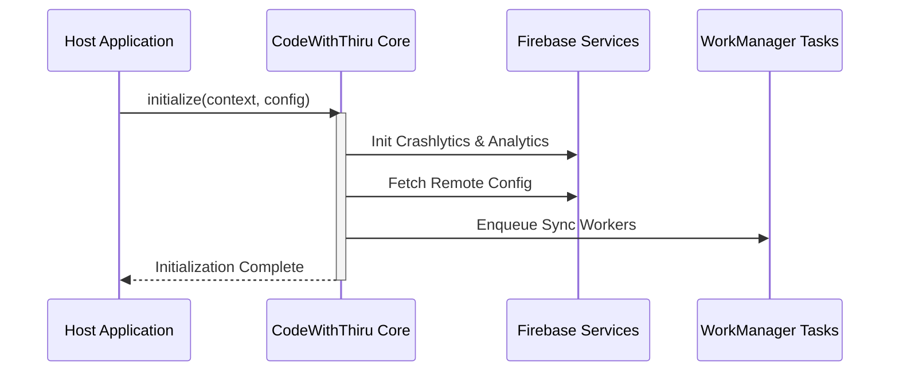

# CodeWithThiru Platform Integration Guide

Welcome to the CodeWithThiru Platform SDK Integration Guide. This document provides step-by-step instructions for embedding the core platform and its optional modules into your Android host application.

## 1. Gradle Setup

Add the CodeWithThiru Maven repository to your project-level `settings.gradle.kts` or `build.gradle.kts`:

```kotlin
dependencyResolutionManagement {
    repositoriesMode.set(RepositoriesMode.FAIL_ON_PROJECT_REPOS)
    repositories {
        google()
        mavenCentral()
        maven {
            name = "CodeWithThiruPlatform"
            url = uri("https://arasu33.github.io/codewiththiru-platform/maven")
        }
    }
}
```

Next, include the required dependencies in your app-level `build.gradle.kts`:

```kotlin
dependencies {
    // Platform BOM (aligns versions)
    implementation(platform("com.codewiththiru.platform:platform-bom:1.5.1"))
    
    // Core Platform
    implementation("com.codewiththiru.platform:core")
    implementation("com.codewiththiru.platform:core-android")
    
    // Optional Modules
    implementation("com.codewiththiru.platform:ads")
    implementation("com.codewiththiru.platform:billing")
    implementation("com.codewiththiru.platform:analytics")
}
```

## 2. Manifest Configuration

You must register your unique Platform API Key inside the `AndroidManifest.xml` within the `<application>` tag. Additionally, configure the AdMob App ID if you are using the monetization module.

```xml
<application
    android:name=".MyHostApplication"
    android:icon="@mipmap/ic_launcher"
    android:label="@string/app_name"
    android:theme="@style/Theme.MyHostApp">

    <!-- CodeWithThiru Platform Key -->
    <meta-data
        android:name="com.codewiththiru.platform.API_KEY"
        android:value="${CWT_API_KEY}" />

    <!-- Google AdMob Application ID -->
    <meta-data
        android:name="com.google.android.gms.ads.APPLICATION_ID"
        android:value="${ADMOB_APP_ID}" />

</application>
```

## 3. Initialization & Configuration

Initialize the platform in your custom `Application` class. This ensures all background workers (like WorkManager analytics syncing) and singleton instances are prepped before any `Activity` starts.

```kotlin
package com.example.hostapp

import android.app.Application
import com.codewiththiru.platform.core.CodeWithThiru
import com.codewiththiru.platform.core.config.PlatformConfig
import com.codewiththiru.platform.core.config.Environment

class MyHostApplication : Application() {

    override fun onCreate() {
        super.onCreate()

        val config = PlatformConfig.Builder()
            .setEnvironment(if (BuildConfig.DEBUG) Environment.STAGING else Environment.PRODUCTION)
            .enableCrashReporting(true)
            .setRemoteConfigDefaults(R.xml.remote_config_defaults)
            .build()

        CodeWithThiru.initialize(this, config)
    }
}
```

### Initialization Flow



## 4. Verification

To verify that the platform is integrated correctly:
1. Run your app in debug mode.
2. Filter Logcat by the tag `CWT_PLATFORM`.
3. Look for the message: `CWT_PLATFORM: Initialization successful. Environment: STAGING.`
4. To test billing or ads, use the test IDs provided in the Google Play Console and AdMob Dashboard.
