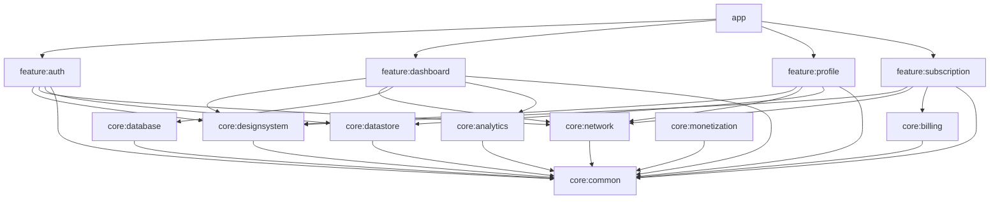

# Module Dependency Graph

The following Mermaid diagram visualizes the dependency graph of the CodeWithThiru Platform. 

Arrows indicate dependencies (e.g., `app` depends on `feature:auth`). To avoid circular dependencies and ensure high build concurrency, feature modules do not depend on one another. Instead, they interact via interfaces, implicit navigation, or core shared state.

> [!TIP]
> This graph is kept as flat as possible. The `core:common` module sits at the very bottom and contains generic utilities, extensions, and base classes used across the entire platform.
