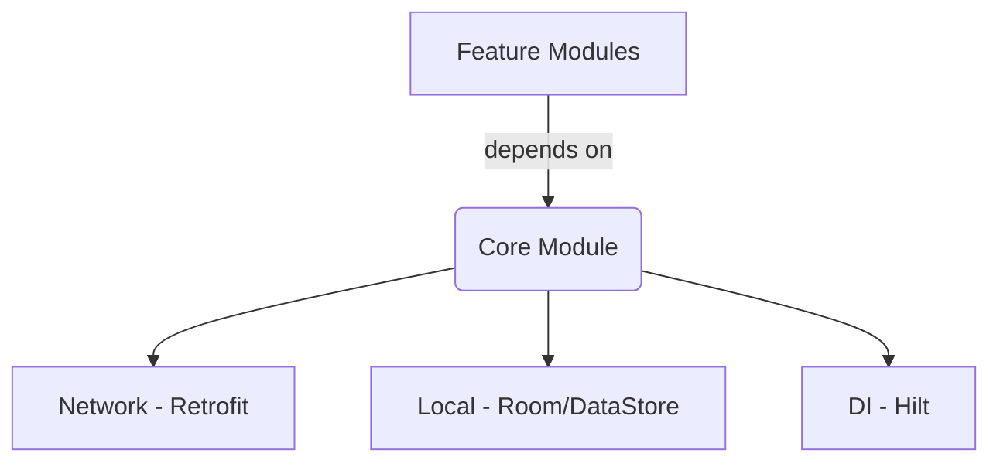

# Core Module (`:core`)

## Purpose
The `:core` module serves as the foundational layer of the CodeWithThiru Platform. It provides essential utilities, base classes, dependency injection setup, networking clients, and local persistence mechanisms. All other feature modules depend on this module.

## Architecture
- **Layer:** Data / Domain / Utilities
- **Pattern:** Clean Architecture principles.
- **Components:**
  - `di`: Hilt modules for cross-cutting dependencies.
  - `network`: Retrofit and OkHttp clients, interceptors.
  - `local`: Room database base configurations, DataStore preferences.
  - `dispatchers`: Coroutine dispatchers for testing and execution.



## Public APIs
- `NetworkClient`: Configured Retrofit instance builder.
- `BaseRepository`: Abstract class for handling safe API calls and mapping responses.
- `AppDispatchers`: Interface for injecting `IO`, `Default`, and `Main` dispatchers.
- `NetworkMonitor`: Flow-based utility to monitor network connectivity.

## Configuration
Requires a valid base URL in the `build.gradle.kts` via `buildConfigField`.

## Dependencies
- Dagger Hilt (`com.google.dagger:hilt-android`)
- Retrofit & OkHttp (`com.squareup.retrofit2:retrofit`, `com.squareup.okhttp3:logging-interceptor`)
- Room (`androidx.room:room-runtime`, `androidx.room:room-ktx`)
- DataStore (`androidx.datastore:datastore-preferences`)

## Initialization
In the application class, Hilt handles the initialization of core components.
```kotlin
@HiltAndroidApp
class MainApplication : Application() {
    // Core dependencies injected automatically
}
```

## Integration Steps
1. Add `implementation(project(":core"))` to your feature module's `build.gradle.kts`.
2. Inject needed core components using `@Inject`.

## Required Permissions
```xml
<uses-permission android:name="android.permission.INTERNET" />
<uses-permission android:name="android.permission.ACCESS_NETWORK_STATE" />
```

## Manifest Entries
No specific `<activity>` entries.

## Remote Config & Analytics Dependencies
- Evaluates `network_timeout_ms` via Firebase Remote Config to dynamically adjust OkHttp timeouts.

## Security
- Certificate pinning configured in OkHttp via `SecurityConfig`.
- EncryptedSharedPreferences wrapper available for sensitive legacy data.

## Accessibility
N/A (No UI components in core).

## Testing
- `CoreTestModule`: Replaces standard dispatchers with `UnconfinedTestDispatcher`.
- Includes MockWebServer helpers for network testing.

## Migration
When migrating from v1 to v2:
- Replace `SharedPreferences` with `DataStore`. See `CoreMigrationHelper`.

## Troubleshooting
| Issue | Cause | Solution |
|-------|-------|----------|
| Network calls failing | Missing `INTERNET` permission | Ensure manifest includes permission. |
| DB version mismatch | Room schema changed | Increment DB version and provide a `Migration`. |

## Examples
```kotlin
@Inject
lateinit var dispatchers: AppDispatchers

viewModelScope.launch(dispatchers.io) {
    // Background work safely executed
}
```
