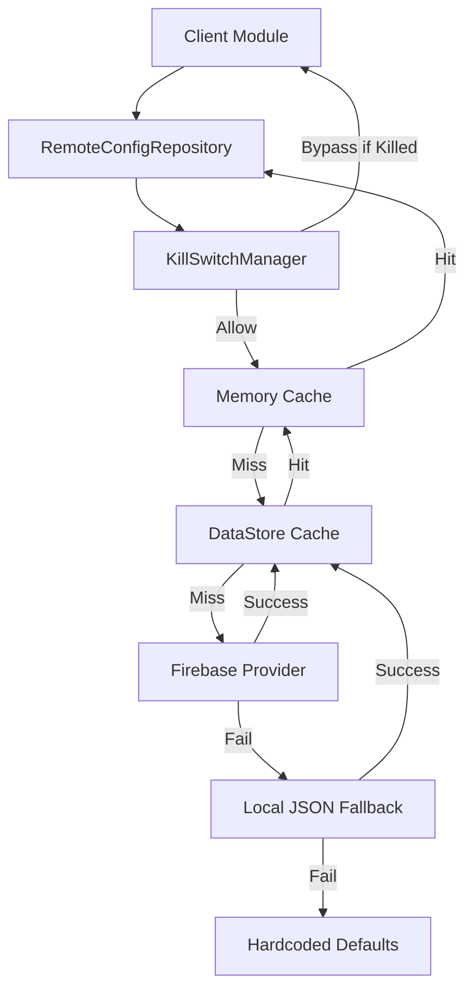

# Architecture Overview

## Clean Architecture Principles

The Remote Config module follows clean architecture:
- **Core Domain:** `RemoteConfigKey`, `FeatureFlag`, `Experiment` are domain models independent of implementation details.
- **Provider Pattern:** `RemoteConfigProvider` abstraction hides Firebase and JSON specific libraries. The rest of the app never imports `com.google.firebase`.
- **Repository Pattern:** `DefaultRemoteConfigRepository` acts as the single source of truth and orchestrator for caching, validation, and analytics.

## Strategy / Hierarchy

## Refresh Engine
The default refresh engine utilizes a 6-hour TTL (`REFRESH_INTERVAL_MS`).
A `Mutex` ensures that concurrent requests for `refresh()` from multiple parts of the app during startup collapse into a single network call.
